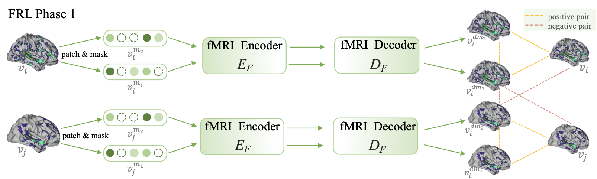
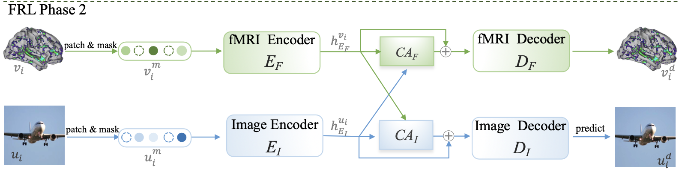
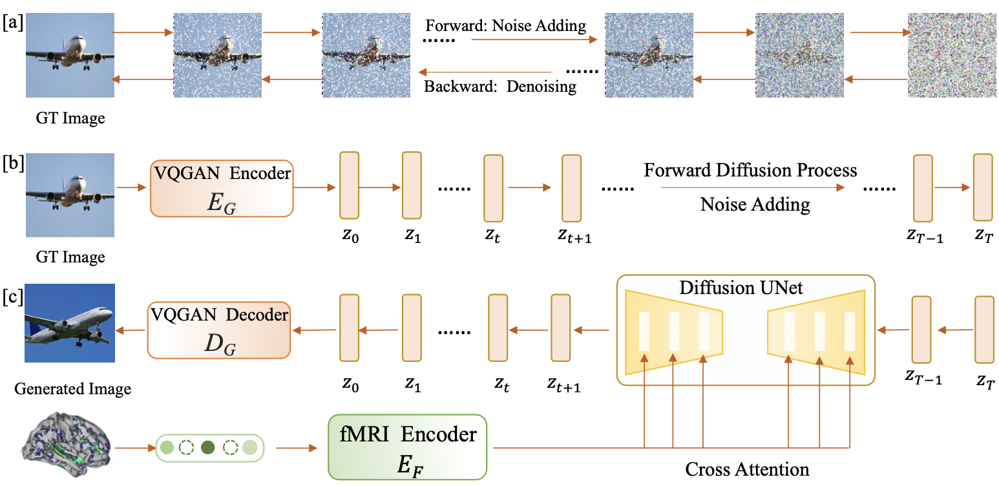
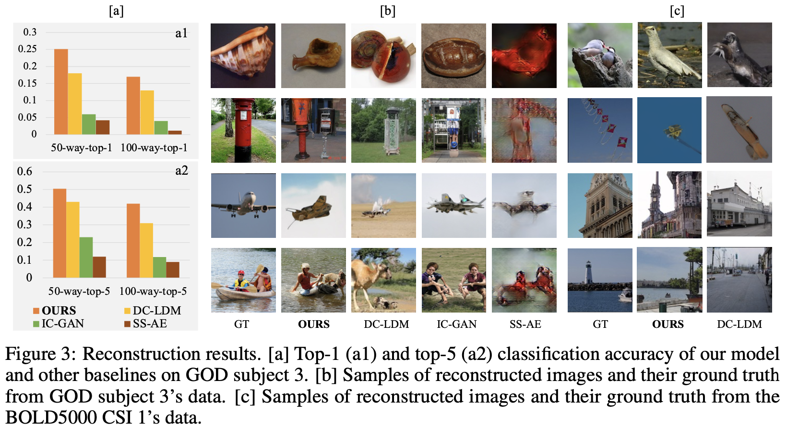
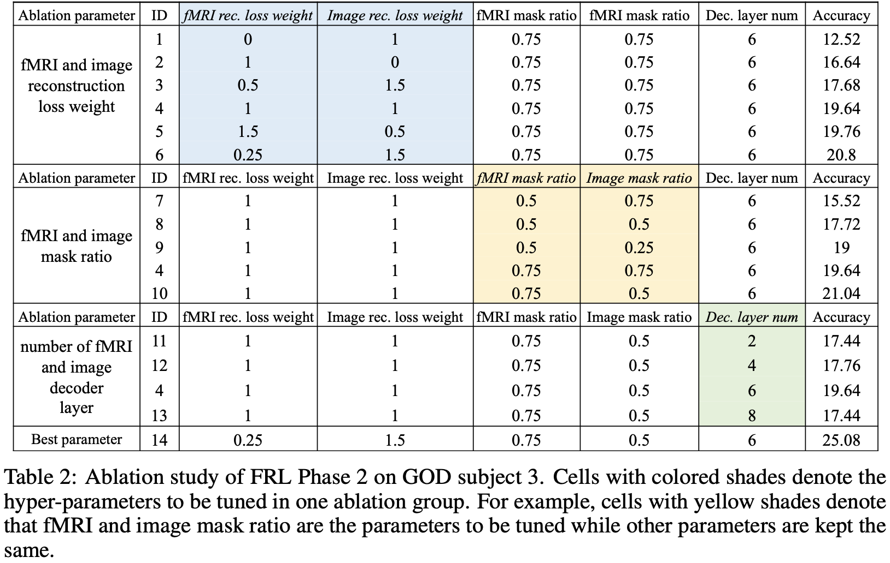

#

Author: <a href="https://yusijin02.github.io/">Sijin Yu</a>

[TOC]

> **标题**: Contrast, Attend and Diffuse to Decode High-Resolution Images from Brain Activities
> **作者**: Jingyuan Sun, Mingxiao Li, Zijiao Chen, Yunhao Zhang, Shaonan Wang, Marie-Francine Moens
> **机构**: 鲁汶大学, 新加坡国立大学, 中国科学院
> **arXiv**: https://arxiv.org/abs/2305.17214
> **GitHub**: https://github.com/soinx0629/vis_dec_neurips/
> **Accepted**: NeurIPS 2023

## 1. Abstract

- 解码功能性磁共振成像 (fMRI) 记录的神经反应中的视觉刺激, 是认知神经科学和机器学习之间的一个有趣交叉点, 这对于理解人类视觉感知的进步充满了希望.
- 然而, 这项任务由于功能性磁共振成像 (fMRI) 信号的噪声性质和大脑视觉表征的复杂模式而具有挑战性.
- 为了减轻这些挑战, 我们引入了一个两阶段的功能性磁共振成像 (fMRI) 表征学习框架.
- 第一阶段使用我们提出的**双重对比掩码自编码器 (Double-contrastive Mask Auto-encoder)** 来预训练一个功能性磁共振成像 (fMRI) 特征学习器, 以学习去噪的表征.
- 第二阶段**微调特征学习器**, 使其关注对视觉重建最具信息性的神经激活模式, 这一过程得到图像自编码器的指导.
- 优化后的功能性磁共振成像 (fMRI) 特征学习器随后使潜在扩散模型适应, 以便从大脑活动中重建图像刺激.
- 实验结果表明, 我们的模型在生成高分辨率和语义上准确的图像方面表现出色, 其在50种方式中排名第一的语义分类准确率上比以往的最先进方法高出39.34.

## 2. Motivation & Contribution

### 2.1 Motivation

- fMRI 信号包含了大量噪音, 其不只是记录了视觉刺激, 还包括了其它认知过程.
- fMRI 是血氧水平的信号, 相邻的体素大小相近, 这说明 fMRI 有空间冗余.
- 对相同的刺激, 人群之间的响应表现巨大的差异.

### 2.2 Contribution

- 提出双阶段 fMRI 表征学习框架.
  - 第一阶段: 使用 DC-MAE 在未标记 fMRI 数据上预训练特征学习器, 辨别大脑活动模式.
  - 第二阶段: 使用图像自编码器进一步调整特征学习器.
- 训练后的 fMRI 特征学习器用于从大脑活动中重建图像刺激.
- 实验结果显示, 在生成高分辨率、语义准确图像方面显著优于现有技术.

## 3. Model

模型分为两个部分: **fMRI 的表示学习 (fMRI Representation Learning, FRL)** 和使用 **LDM** 重建视觉信号.

### 3.1 FRL 第一阶段: 预训练双对比掩码自动编码器 (Pre-training Double-Contrastive Masked Auto-Encoder, DC-MAE)

- 令批量大小为 $n$, 第 $i$ 个 fMRI 信号样本为 $v_i$, $i\leq n$.
- 对于每一个样本 $v_i$, 计算两个随机 mask 后的样本, 分别为 $v_i^{m_1}$ 和 $v_i^{m_2}$.

- 构成正、负样本, 如图所示.

### 3.2 FRL 第二阶段: 使用互模态引导微调 (Tuning with Cross Modality Guidance)

- 令 fMRI 样本 $v_i$ 对应的视觉刺激样本为 $u_i$.

- $v_i$ 和 $u_i$ 分别经过各自的 Encoder, 得到 $h_{E_F}^{v_i}$ 和 $h_{E_{I}}^{u_i}$.

- 计算 CA (互注意力): ($K, V$ 为本模态, $Q$ 为另一模态)

  以 fMRI 的 $CA_F$ 为例 (下面的每个 $W$ 都不一样)

  - $Q=W h_{E_I}^{u_i}$.
  - $K=Wh_{E_F}^{v_i}$
  - $V=Wh_{E_F}^{v_i}$.

- Decoder: $v_i^d=D_F(h_{E_F}^{v_i}+CA_F(Q, K, V))$.

- 在这一阶段的优化目标为: $L=\gamma_F(v_i-v_i^d)^2+\gamma_I(u_i-u_i^d)^2$.

### 3.3 使用 LDM 的图像生成

这个方法很经典, 略过.

## 4. Experiment

### 4.1 Dataset

- **HCP1200**
- **GOD**
- **BOLD5000**

### 4.2 横向对比

### 4.3 消融实验

